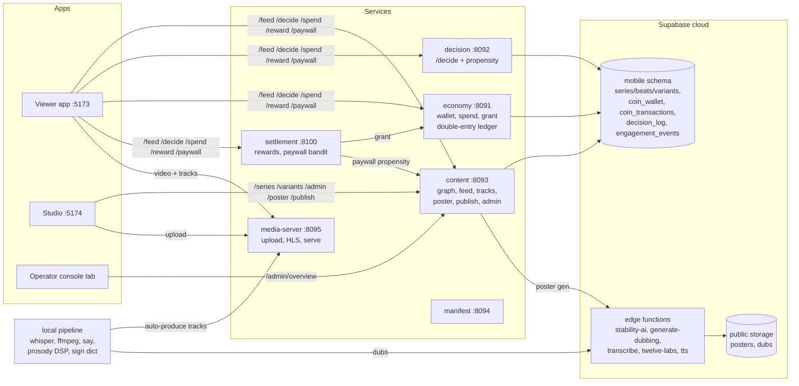
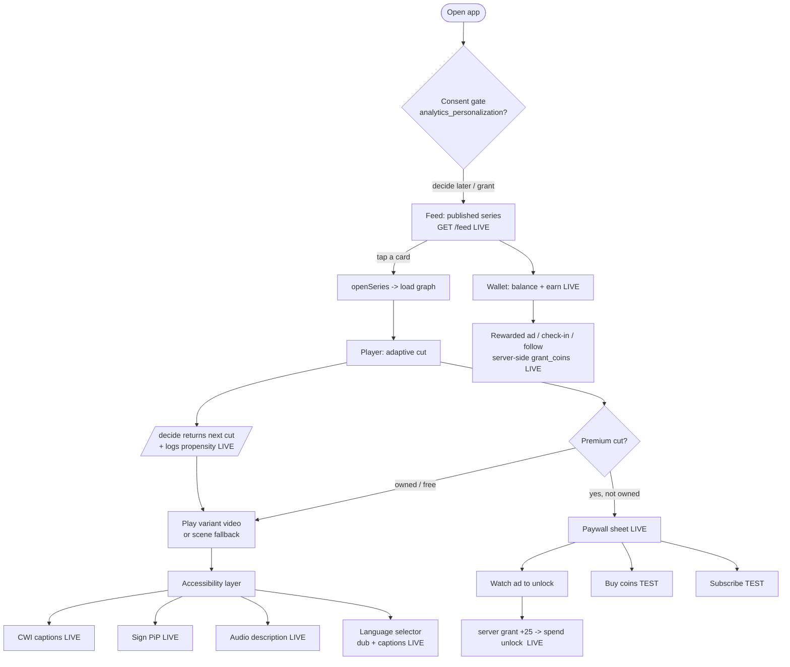
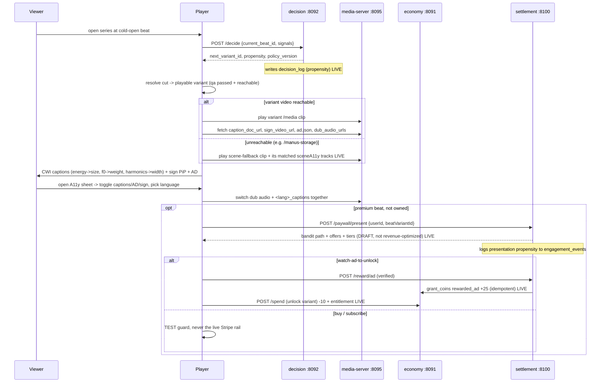
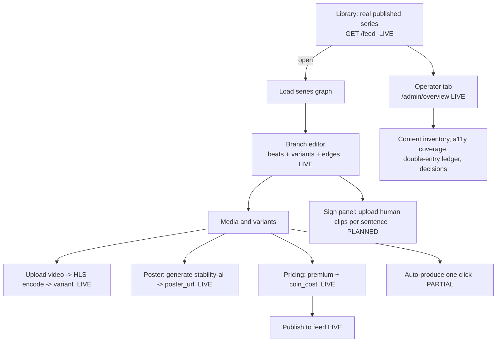
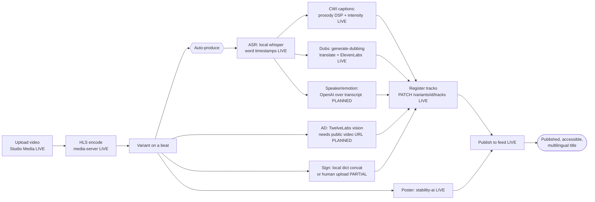
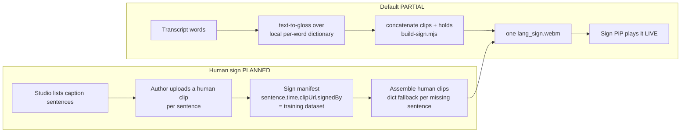

# Axessplayer UX and system flows

End-to-end flows for the Viewer app and the Studio, plus the overall system. Diagrams are Mermaid (render
on GitHub). Markers: [LIVE] proven against the hosted mobile schema, [PARTIAL] built but not fully wired,
[PLANNED] designed, not built. No em dashes.

Local ports: consumer 5173, Studio 5174, content 8093, economy 8091, decision 8092, manifest 8094,
media-server 8095, settlement 8100, console 8123. Hosted Supabase project faeyekynudyzeotbjfsj, schema
mobile.

---

## 1. System overview



---

## 2. Viewer journey (overall)



---

## 3. Player internals (decide + accessibility + paywall)



---

## 4. Studio journey (overall)



---

## 5. Auto-produce pipeline (upload to published accessible title)



Proven run (variant 7d7fcab6, upload mqiei6lu, 47 dialogue segments): whisper -> 47-segment CWI captions
-> es + fr real translated dubs -> poster -> publish, all registered and serving. A no-speech clip yields
empty captions correctly (the speech-dependent stages need dialogue).

---

## 6. Monetization flows

```mermaid
flowchart TD
  subgraph Rewards [Earn coins  LIVE]
    ra[Watch rewarded ad] --> rac[server callback /reward/ad<br/>daily cap 5, idempotent]
    ci[Daily check-in<br/>forgiving streak] --> cic[/reward/checkin once/day]
    fb[Follow bonus] --> fbc[/reward/follow once]
    rac & cic & fbc --> gc[grant_coins -> double-entry ledger<br/>never from client]
  end
  subgraph Paywall [Unlock premium  LIVE backend]
    pp[/paywall/present] --> bandit[DRAFT path bandit<br/>watch_ad / buy / subscribe<br/>neutral, propensity-logged,<br/>NO revenue extraction]
    bandit --> wa[watch-ad-to-unlock<br/>grant then spend  LIVE]
    bandit --> bu[buy coin pack  TEST]
    bandit --> su[subscribe tier  TEST]
  end
```

Hard rules that no sign-off lifts: revenue extraction is never the bandit objective; anti-dark-pattern
(spend cool-down, transparent pricing, no manipulation); content/ad firewall; the live Stripe rail is never
invoked without a separate decision.

---

## 7. Sign language: current vs planned



The PiP contract stays one webm, so human uploads need no player change; the manifest doubles as the
sign-model training set.

---

## 8. Founder gates (state)

- Money/ledger: signed off. Stripe stays TEST until a separate live-rail decision.
- Biometric/consent + provenance: signed off (consent-ledger + C2PA writes may go live).
- Reward-weights: signed off (bandit may optimize on viewer continuation; extraction stays off).
